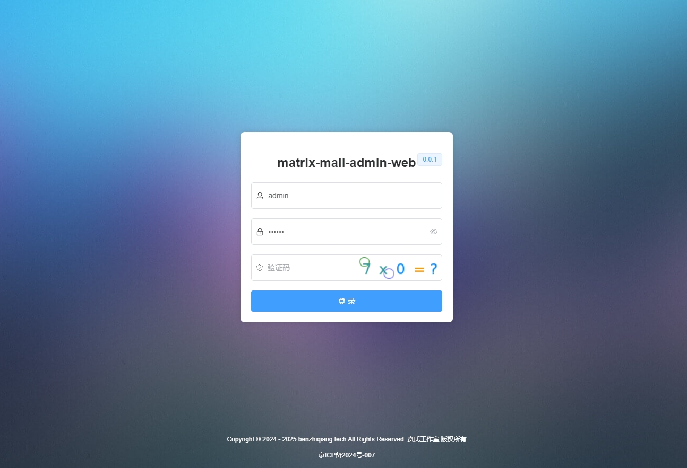
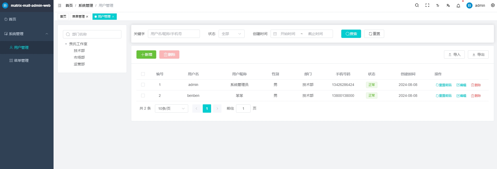
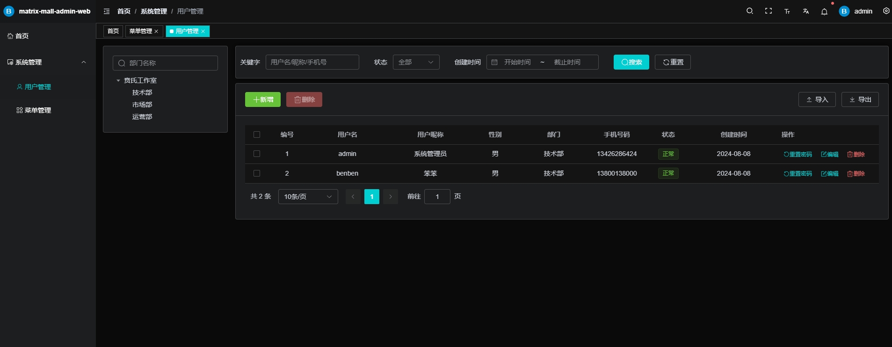

  
  <h1>matrix-mall-admin-spring-boot</h1>

  
  
  
   
  
  

## 项目简介

[matrix-mall-admin-spring-boot](https://gitee.com/benben7466/matrix-mall-admin-spring-boot) 基于 JDK 17、Spring Boot 3、Spring Security 6、JWT、Redis、Mybatis-Plus、Knife4j、Vue 3、Element-Plus 构建的前后端分离单体权限管理系统

## 项目初衷

打造极简的企业级后台脚手架。

## 项目特色

- **🚀 开发框架**: 使用 Spring Boot 3 和 Vue 3，以及 Element-Plus 等主流技术栈，实时更新。

- **🔐 安全认证**: 结合 Spring Security 和 JWT 提供安全、无状态、分布式友好的身份验证和授权机制。

- **🔑 权限管理**: 基于 RBAC 模型，实现细粒度的权限控制，涵盖接口方法和按钮级别。

- **🛠️ 功能模块**: 包括用户管理、角色管理、菜单管理、部门管理、字典管理等多个功能。

## 项目预览

## 🚀 项目启动

1. **数据库初始化**

   执行 [matrix_springboot.sql](doc/sql/matrix_springboot.sql) 脚本完成数据库创建、表结构和基础数据的初始化。

2. **修改配置**

   [application-dev.yml](src/main/resources/application-dev.yml) 修改MySQL、Redis连接配置；

3. **启动项目**

   执行 [SystemApplication.java](src/main/java/com/youlai/system/SystemApplication.java) 的 main 方法完成后端项目启动；

## 🌺 后端系统的展示工程
| Gitee | Github |
|-------|------|
| [MatrixMall-admin-web](https://gitee.com/benben7466/matrix-mall-admin-web)  | [MatrixMall-admin-web](https://github.com/benben7466/MatrixMall-admin-web)  |

## 🌺 后端系统的服务工程
| Gitee | Github |
|-------|------|
| [MatrixMall-admin-SpringBoot](https://gitee.com/benben7466/matrix-mall-admin-spring-boot)  | [MatrixMall-admin-SpringBoot](https://github.com/benben7466/MatrixMall-admin-SpringBoot)  |

## 交流与业务洽谈🚀
>
> 作者微信：benben7466，添加时请备注您的需求与目的。
>
> 如果需要业务洽谈，请访问官网：[贲氏工作室](http://benzhiqiang.w1.luyouxia.net/)，联系电话：134-2628-6424
> 